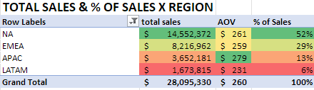

# TechHaven - E-commerce Analysis

TechHaven is a global e-commerce company founded in 2018 specializing in consumer
electronics. This analysis covers **$28M in revenue across 108K orders from 2019–2022**,
examining product trends, refunds, loyalty program performance, and marketing channels.

---

# Executive Summary

  

TechHaven generated $28M in revenue across 108K orders from 2019–2022, with the
pandemic driving a historic 2020 surge that proved unsustainable. By 2022, all key
metrics had fallen below pre-pandemic baselines, while structural issues in the loyalty
program and data integrity gaps in refunds limit the ability to draw definitive
conclusions.

- **$28M in total revenue**, 108K orders, $260 AOV across 2019–2022
- **Pandemic peak (Mar 2020–Mar 2021):** $12M in sales, $297 AOV, 39K orders
- **Post-normalization (Jan 2022+):** Revenue fell to $4M, AOV declined to $229
- **Gaming Monitor, AirPods, and MacBook** account for ~82% of total revenue
- **Loyalty program is not driving retention** — only 39 of 45K members made repeat purchases
- **Email is the only channel** to grow in both 2020 (+223%) and 2021 (+24%)
- **⚠️ 2022 refund data missing** — likely a data integrity issue requiring validation

---

# Analysis & Insights

## Product Trends & Apple Spotlight

Three products dominate TechHaven's revenue and order share across all four years,
while Apple — once the category leader — has seen continued decline since Q4 2021.
Gaming Monitor has steadily grown its revenue share, absorbing the gap left by
MacBook's erosion.

### Performance by Period

| Period | Total Sales | AOV | Total Orders |
|---|---|---|---|
| 2019–2022 (Full) | $28M | $260 | 108K |
| Jan 2019–Mar 2020 (Pre-Pandemic) | $5M | $237 | 20K |
| Mar 2020–Mar 2021 (Pandemic Peak) | $12M | $297 | 39K |
| Mar 2021–Jan 2022 (Post-Pandemic) | $7M | $246 | 30K |
| Jan 2022+ (Normalization) | $4M | $229 | 19K |

### Pricing Anomalies

Several products show orders at price ranges inconsistent with known retail pricing,
flagged for data integrity review before drawing conclusions on AOV or revenue figures.

| Product | Suspicious Price Range | Order Count | AOV |
|---|---|---|---|
| 27in 4K Gaming Monitor | $1–$100 | 73 | $421 |
| Apple AirPods | $1–$50 | 183 | $160 |
| MacBook Air Laptop | $1–$1,000 | 259 | $1,591 |
| Samsung Charging Cable Pack | $1,000+ | 1 | $20 |
| ThinkPad Laptop | <$1,000 | 550 | $1,101 |

- **ThinkPad and MacBook** represent the largest risk — 550 and 259 orders at prices well below retail
- **Samsung Charging Cable's** single $1,000+ order is likely a data entry error given its $20 AOV

### Top 3 Product Share

Revenue and order leadership tell different stories — Gaming Monitor leads in dollars
while AirPods dominate by volume, highlighting a meaningful gap between what drives
revenue and what drives order count.

  
  

- **Revenue leaders:** Gaming Monitor ($9.8M), AirPods ($7.7M), MacBook ($6.3M) — 82% of total
- **Order leaders:** AirPods (48K), Gaming Monitor (23K), Samsung Charging Cable (22K)
- **Samsung Charging Cable:** 22K orders but only $442K revenue due to its $20 AOV
- **Gaming Monitor revenue share** has grown from ~35% to 50%+ by late 2022
- **MacBook revenue share eroding** since Q4 2021, absorbed by Gaming Monitor growth

### Portfolio Risk

~97% of revenue is concentrated among a small number of brands, creating meaningful
dependency risk. Two products — Bose and Samsung Webcam — show trends that warrant
close monitoring heading into future planning cycles.

- **~97% of revenue** concentrated among Apple, Lenovo, and a small group of brands
- **Bose:** -91% decline in 2022 across only 27 total orders — insufficient for conclusions
- **Samsung Webcam:** +134% in 2021 driven by remote work demand — unlikely to sustain

### Gaming Monitor by Region

Gaming Monitor is the top-performing product in every region, with North America
leading by a wide margin. LATAM and APAC remain minimal contributors, suggesting
limited penetration at the product's current price point.

  

- **Most popular product in all regions** — NA leads at nearly 3x EMEA
- **NA peaked at ~$186K** monthly in Jan 2022; late-2022 uptick worth monitoring
- **LATAM and APAC** contribute minimally throughout the period

### Apple Spotlight

Apple peaked in late 2020 and has declined steadily across all regions since Q4 2021,
with the steepest drop occurring in 2022. MacBook's parallel decline in sales and
volume points to a demand problem rather than a pricing or product mix issue.

  

- **Apple peaked Sep–Dec 2020**, declining in all regions since Q4 2021
- **MacBook sales and volume move in lockstep** — a volume problem, not a pricing issue
- **Q4 2022 MacBook AOV dropped to ~$1,200** from a typical $1,500–$1,700 range — investigate
- **AirPods:** 48K orders at $160 AOV — most consistent and predictable volume driver
- Apple refunds outpace all other brands — see [Refunds](#refunds) for full breakdown

---

## Refunds

MacBook Air generates the highest total refund dollar impact at $717K, making it the
most financially significant refund risk in the portfolio despite not having the highest
refund count. A 2022 data gap prevents definitive trend conclusions and should be
resolved before drawing year-over-year comparisons.

  
  

- **MacBook:** Highest total refund value at $717K (452 refunds, 11% rate, $1,588 AOV)
- **Gaming Monitor:** $608K total refund value (1,445 refunds, 6% rate)
- **AirPods:** $421K total refunds — 3rd despite most refunds (2,636) due to $160 AOV
- **ThinkPad:** Highest refund rate at 12% but only 4th in total impact ($377K, 343 refunds)
- **Rate alone is misleading** — AOV and volume must be considered together
- **Apple:** 58% of all refunds (3,110) at 6% avg rate — driven by AirPods order volume
- **Lenovo:** 12% rate | **Samsung:** 2% rate | **Bose:** 0% across 27 orders (unreliable)
- **Premium tier products** carry the highest blended refund rate at 7% across ~4K refunds
- **2020 spike:** AirPods generated ~1,550 refunds — nearly double 2019 volume
- **⚠️ 2022 data flag:** 0 refunds recorded despite 21,565 orders — ~1,000+ expected
- **Loyalty members:** 2.8K refunds vs. non-loyalty 2.5K despite fewer total orders
- **Non-loyalty refund AOV:** ~$549 vs. loyalty ~$297 — converging to ~$225 by 2022

*Refund behavior by loyalty segment raises broader questions about program effectiveness —
see [Loyalty Program Performance](#loyalty-program-performance) below.*

---

## Loyalty Program Performance

The loyalty program shows critical structural weaknesses that undermine its core
premise of driving retention and repeat purchase behavior. Despite generating more
total sales than non-loyalty since Q2 2021, the program's repeat purchase rate is
effectively zero — and its performance advantages have fully eroded by Q4 2022.

  

  
  

- **38,756 loyalty members vs. 48,842 non-loyalty** across the period
- **Loyalty overtook non-loyalty in total sales from Q2 2021** — but non-loyalty pulled ahead in Q4 2022
- **Non-loyalty generated ~$17M vs. loyalty ~$11M** across the full period despite the 2021 crossover
- **⚠️ 0% effective repeat rate** — only 39 of 38,756 members purchased on multiple dates
- **$29K in repeat sales** from returning members — program is enrolling but not retaining
- **Loyalty AOV has been flat** (~$220–$260) throughout — the crossover reflects non-loyalty
  decline, not loyalty strength
- **Non-loyalty AOV spiked to ~$380** in 2020 then crashed back, overtaking loyalty by Q4 2022
- **Loyalty members refund more** (2.8K vs. 2.5K) despite fewer total orders

  

**Verdict:** With a 0% repeat rate, higher refund frequency, and eroding performance
advantages by end of 2022, the program requires significant restructuring to deliver
on its core retention objective.
---

## Marketing Channel Performance

Email is the standout managed channel — the only one to sustain growth beyond the
pandemic spike — and serves as the primary touchpoint for loyalty members. Direct
traffic dominates overall revenue but reflects organic customer behavior rather than
a managed acquisition strategy.

- **Email only channel to grow in both 2020 (+223%) and 2021 (+24%)** — all others declined in 2021
- **Email is the primary loyalty channel** — only channel where loyalty leads non-loyalty (11K vs. 8K orders)
- **Direct dominates at $23M (~82%)** — organic behavior, not a managed channel
- **Affiliate has the highest AOV** at ~$303 despite only 2,900 orders — underinvested
- **Social Media:** Highest refund rate at 7.58% despite only 1,293 orders
- **Unknown channel:** Spiked +2,325% in 2020 and +295% in 2022 — likely an attribution error

| Channel | Order Count | Refund Rate | 2020 YoY | 2021 YoY |
|---|---|---|---|---|
| Email | 18,553 | 4.76% | +222.60% | +24.46% |
| Direct | 83,884 | 5.03% | +160.59% | -12.70% |
| Affiliate | 2,900 | 4.76% | +86.36% | -41.29% |
| Social Media | 1,293 | 7.58% | +95.02% | -21.32% |
| Unknown | 1,469 | 2.45% | +2,324.56% | -12.32% |

---

## Regional Performance

North America and EMEA drive the overwhelming majority of TechHaven's revenue, and
all four regions followed the same pandemic-driven growth and post-2021 decline
pattern. LATAM is the only market with a meaningfully different seasonal profile.

  
  

- **NA accounts for ~54% of revenue ($14M)**, EMEA ~30% ($8M)
- **All regions followed the same pattern** — 2020 spike, 2021 peak, 2022 contraction
- **NA declined -16% in 2021** (less than other regions) then -39% in 2022
- **Nov–Dec peak** for NA, EMEA, and APAC — consistent holiday-driven demand
- **LATAM outlier** — strongest performance in July, not November–December

---

| Priority | Department | Recommendation |
|---|---|---|
| 🔴 High | **Product** | Investigate Apple's steep 2022 decline — root cause analysis needed |
| 🔴 High | **Product** | Resolve pricing anomalies flagged across 5 products |
| 🔴 High | **CRM** | Restructure loyalty program — 0% repeat rate indicates fundamental retention failure |
| 🔴 High | **CRM** | Audit purchase history of loyalty members — low repeat rate and single-purchase product nature suggest members may be signing up for a one-time discount with no intent to return |
| 🔴 High | **CRM** | Evaluate profitability of loyalty member sign-ups — if acquisition costs are not recovered through repeat purchases, the program's net value may be negative |
| 🔴 High | **Marketing** | Invest in Email — only channel growing in both 2020 and 2021; primary loyalty touchpoint |
| 🟡 Medium | **Sales** | Expand brand portfolio to reduce ~97% revenue concentration risk |
| 🟡 Medium | **CRM** | Introduce loyalty member benefits to drive engagement — e.g. exclusive offers, shipping perks, or early product access |
| 🟡 Medium | **Marketing** | Resolve Unknown channel attribution anomaly before drawing channel-level conclusions |
| 🟢 Low | **Sales** | Promote Samsung Charging Cables alongside higher-value purchases to increase basket size |
| 🟢 Low | **Product** | Evaluate Bose product line viability — 27 total orders over 4 years |
| 🟢 Low | **Data** | Validate 2022 refund data — 0 refunds across 21,565 orders is likely an error |
